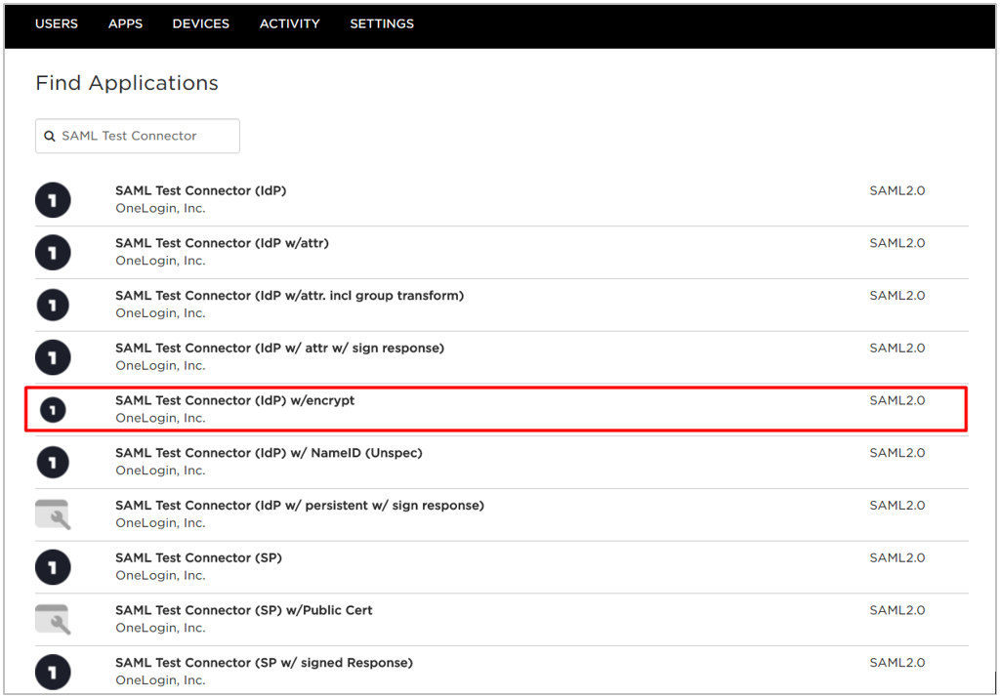
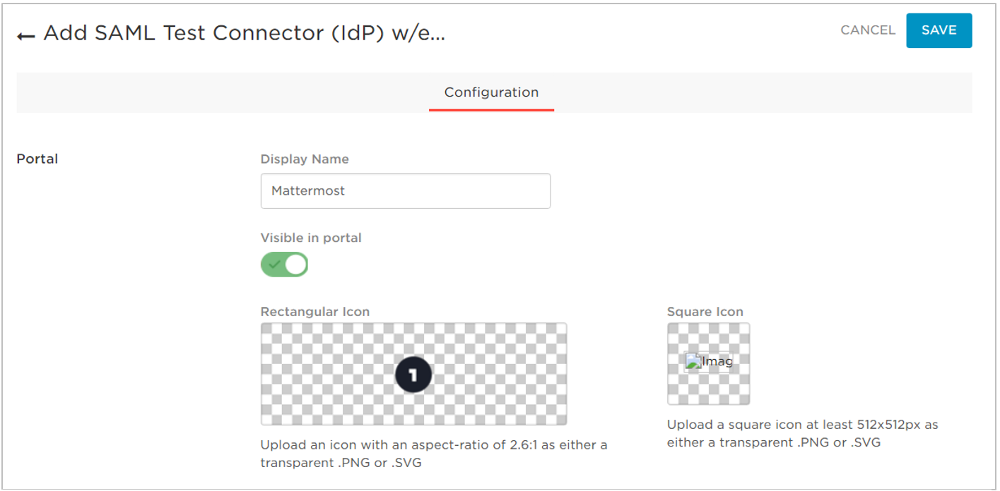
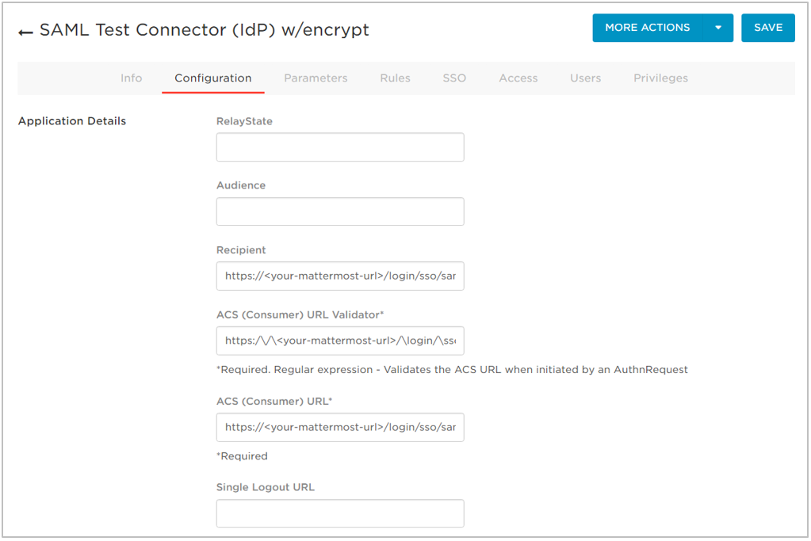
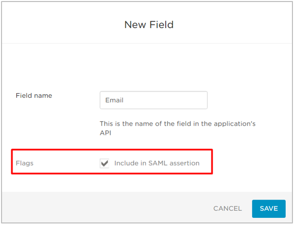
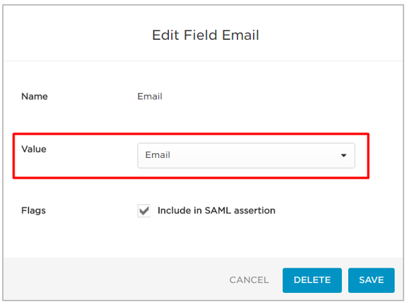
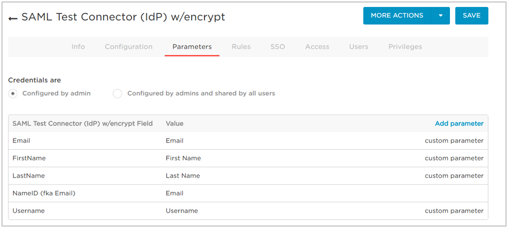
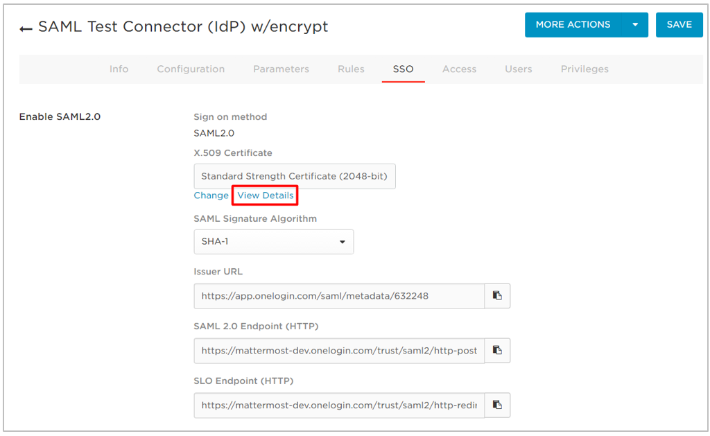
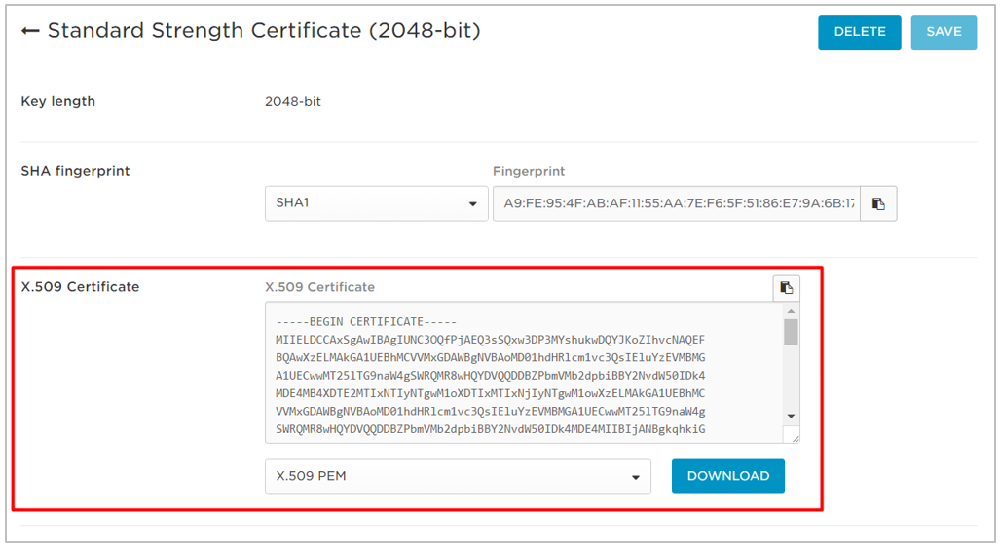

## Configure SAML with OneLogin

The following process provides steps to configure SAML with OneLogin for Mattermost.

### Pre-installation

1 - Before configuring SAML with OneLogin, make sure you have the [XML Security Library](https://www.aleksey.com/xmlsec/download.html) installed on your Mattermost instance. The XML Security Library is usually included as part of Debian GNU/Linux.

Also confirm if the `xmlsec1-openssl` library was successfully installed. If not, run
 - `apt-get install libxmlsec1-openssl` on Ubuntu
 - `yum install xmlsec1-openssl` on RHEL

2 - (Optional) If you would like to set up encryption for your SAML connection, generate encryption certificates now. You are free to use [our script in the `/docs` repo](https://github.com/mattermost/docs/tree/master/source/scripts/generate-certificates) or use another method to generate them.

You should save the two files that are generated, which will be referred to as the **Service Provider Private Key** and the **Service Provider Public Certificate** in this guide.

### Set up a connection app for Mattermost SSO

3 - Sign into OneLogin as an administrator.

4 - Go to **Apps > Add Apps**.

5 - Search for `SAML Test Connector` and choose **SAML Test Connector (IdP) w/encrypt** if you want to enable encryption. 

If you want to set up SAML without encryption, choose **SAML Test Connector (IdP)**.

For the purposes of this guide, we will assume **SAML Test Connector (IdP) w/encrypt** app was chosen.

6 - Enter **Display Name** for the application, and optionally upload an app icon. If you’d like to use a Mattermost logo for the application, you are free to download one [from our page](http://www.mattermost.org/brand-guidelines/).

Keep **Visible in portal** enabled, then click **Save**.

7 - Click the **Configuration** tab and enter the following values:
 - Recipient: `https://<your-mattermost-url>/login/sso/saml`
 - ACS (Consumer) URL: `https://<your-mattermost-url>/login/sso/saml`
 - ACS (Consumer) URL Validator: `https://<your-mattermost-url>/login/sso/saml`
     - This is to validate the ACS consumer URL, entered in regex format.

8 - Copy and paste the **Service Provider Public Certificate** you generated in step 2 to the **SAML Encryption** field. Then click **Save**.

9 - Click the **Parameters** tab to enter attribute statements, which will be used to map attributes between OneLogin and Mattermost. For more information on which attributes are configurable, see our [documentation on SAML configuration settings](http://docs.mattermost.com/administration/config-settings.html#saml-enterprise). Email and username attributes are required. For Mattermost servers running 3.3 and earlier, first name and last name attributes are also required. Note that there will be a default `Email` parameter on the parameter list, which you can leave unchanged.

10 - To add a new attribute parameter, 
- click "Add Parameter"

- enter the name and select the `Include in SAML assertion` checkbox

- press **Save**
- edit the attribute on the parameter list, and set the apropriate OneLogin value for it

After you've added all the attributes you want to use, the parameter list should look something as follows:

9 - Click the **SSO** tab. Take note of the `Issuer URL` and `SAML 2.0 Endpoint (HTTP)` fields as these will be used later in this guide.

Next, below the `X.509 Certificate` field, click **View Details** to download the `Identity Provider Public Certificate`.

10 - Choose `X.509 PEM` as the certificate type, then click **Download** and save it. You will need to upload it to Mattermost at a later step.

11 - Before you finish setting up a connection app for Mattermost SSO, make sure to save all your changes.

### Configure SAML for Mattermost

12 - Start Mattermost server and sign into Mattermost as a System Administrator. Go to **System Console > Authentication > SAML**, and enter the following fields:
 - **SAML SSO URL**: `SAML 2.0 Endpoint (HTTP)L` from OneLogin, specified in step 9.
 - **Identity Provider Issuer URL**: `Issuer URL` from OneLogin, specified in step 9.
 - **Identity Provider Public Certificate**: X.509 PEM certificate file you downloaded from OneLogin in step 10.

13 - (Optional) Configure Mattermost to verify the signature. The **Service Provider Login URL** is the `ACS (Consumer) URL` you specified in OneLogin in step 7.

14 - (Optional) Enable encryption based on the parameters provided in step 8.

15 - Set attributes for the SAML Assertions, which will be used to update user information in Mattermost. Attributes for email and username are required and should match the values you entered in Okta in step 9. See [documentation on SAML configuration settings](http://docs.mattermost.com/administration/config-settings.html#saml-enterprise) for more detail.

For Mattermost servers running 3.3 and earlier, the first name and last name attributes are also required fields.

16 - (Optional) Lastly, customize the login button text.

17 - Click **Save**.

You’re done! If you’d like to confirm SAML SSO is successfully enabled, switch your System Administrator account from email to SAML-based authentication via **Account Settings > General > Sign-in Method > Switch to SAML SSO** and sign in with your SAML credentials to complete the switch.

It is also recommended to post an announcement about how the migration will work to users.

You may also configure SAML for OneLogin by editing `config.json`. Before starting the Mattermost server, edit `config.json` to enable SAML based on [SAML configuration settings](http://docs.mattermost.com/administration/config-settings.html#saml-enterprise). You must restart the Mattermost server for the changes to take effect.

#### Troubleshooting

The following are troubleshooting suggestions on common error messages and issues. 

##### 1. System Administrator locks themselves out of the system

If the System Administrator is locked out of the system during SAML configuration process, they can set an existing account to System Administrator using [a commandline tool](http://docs.mattermost.com/deployment/on-boarding.html#creating-system-administrator-account-from-commandline). 

##### 2. Received error message: `An account with that username already exists. Please contact your Administrator.`

This usually means an existing account has another authentication method enabled. If so, the user should sign in using that method (such as email and password), then change their sign-in method to SAML via **Account Settings > Security > Sign-in method**.

##### 3. Received error message: `An account with that email already exists. Please contact your Administrator.`

This usually means an existing account has another authentication method enabled. If so, the user should sign in using that method (such as email and password), then change their sign-in method to SAML via **Account Settings > Security > Sign-in method**.

##### 4. Received error message: `SAML login was unsuccessful because one of the attributes is incorrect. Please contact your System Administrator.`

Confirm all attributes, including `Email Attribute` and `Username Attribute`, are correct in both the Okta configuration and in **System Console > SAML**.

##### 5. Unable to switch to SAML authentication successfully

First, ensure you have installed the [XML Security Library](https://www.aleksey.com/xmlsec/download.html) on your Mattermost instance and that **it is available in your** `PATH`.

Second, ensure you have completed each step in our guide above for configuring SAML with OneLogin.

Lastly, if you are still having trouble with configuration, feel free to post in our [Troubleshooting forum](http://www.mattermost.org/troubleshoot/) and we'll be happy to help with issues during setup.
